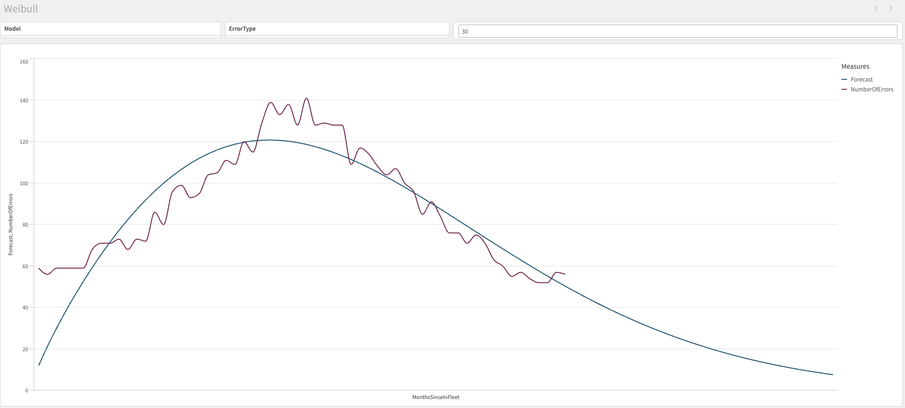

# Weibull Analysis for Qlik Sense Cloud

A FastAPI-based service that provides Weibull distribution analysis capabilities, designed to integrate with Qlik Sense Cloud.



## Server Setup
Ensure you have Python installed.

Create and activate a virtual environment:
```bash
python -m venv venv
source venv/bin/activate  # On Windows, use: venv\Scripts\activate
```

Install requirements:
```bash
pip install -r requirements.txt
```

Start the server:
```bash
uvicorn main:app --host 0.0.0.0 --port 8000
```

Create an advanced analytics connection in Qlik Sense Cloud pointing to your server:
https://help.qlik.com/en-US/cloud-services/Subsystems/Hub/Content/Sense_Hub/LoadData/ac-advanced-analytic-create.htm

## API Endpoints

### GET /
Health check endpoint that returns a simple "Hello World" message.

### POST /weibull
Processes time series data using Weibull distribution analysis and returns fitted values with forecasts.

**Request Body Format:**
```json
[{
    "time": float,    // Time point (e.g., month number)
    "measure": float  // Value to analyze
}]
```

**Response Format:**
```json
[{
    "time": float,    // Time point
    "forecast": float // Fitted/forecasted value
}]
```

## Example Qlik Front End Expression
```qlik
endpoints.ScriptEvalEx('NN', '{"RequestType":"endpoint", "endpoint":{"connectionname":"Demos:Weibull"}}', time, Sum(measure) as measure)
```

## Example Qlik Load Script
```qlik
data:
LOAD
    time,
    measure
FROM [lib://DataFiles/your_data.xlsx]
(ooxml, embedded labels, table is Data);

[forecast]:
Load
    time,
    forecast
EXTENSION endpoints.ScriptEval('{"RequestType":"endpoint", "endpoint":{"connectionname":"Demos:Weibull"}}', data);
```

## Example Qlik app
You can find an example Qlik Sense app in this repo here: https://github.com/rileymd88/weibull-for-qlik-sense-cloud/blob/main/Weibull.qvf

## Technical Details
The service fits a scaled Weibull probability density function (PDF) to your data:
- Uses scipy's curve_fit for parameter estimation
- Automatically handles zero values in the input data
- Provides forecasts beyond the input time range
- Returns both fitted values and forecasts in a single response
